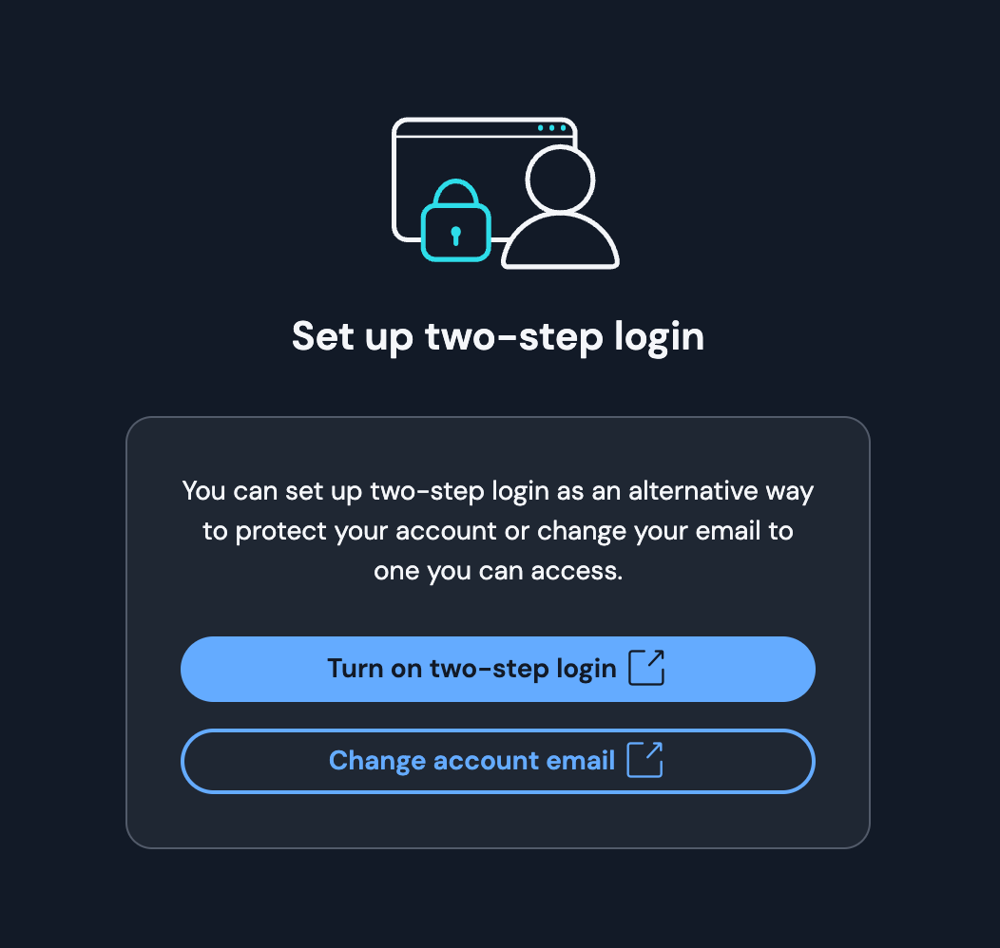
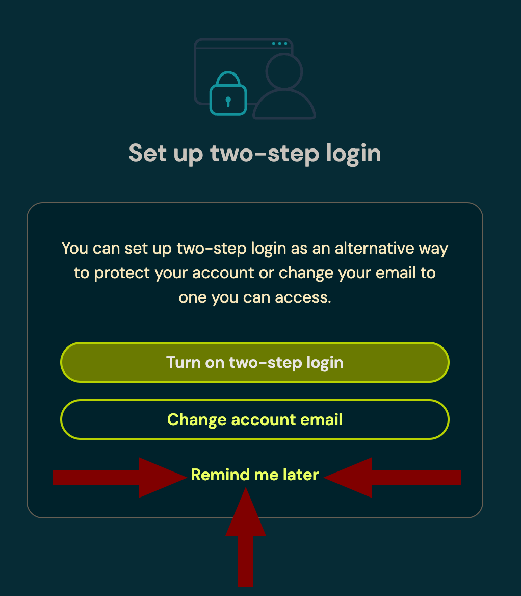

# პაროლების მენეჯერი

/// admonition | სწრაფი დაწყება
    type: tip

1. გადმოწერეთ [Bitwarden](https://bitwarden.com/download/#downloads-desktop){:target="_blank"}
2. შექმენით მთავარი პაროლი [FOI პაროლების გენერატორით](../tools/password-generator/index.md)
3. ჩაიწერეთ პაროლი ფურცელზე (არა ელექტრონულად!)
4. შექმენით ანგარიში Bitwarden-ში, გამოიყენეთ გენერირებული პაროლი
5. დააყენეთ [ბრაუზერის გაფართოება](https://bitwarden.com/download/#downloads-web-browser){:target="_blank"}
6. გადაიტანეთ არსებული პაროლები ბრაუზერიდან Bitwarden-ში
7. წაშალეთ პაროლები ბრაუზერიდან
8. დააყენეთ [მობილური აპლიკაცია](https://bitwarden.com/download/#downloads-mobile){:target="_blank"}

:exclamation: **მნიშვნელოვანი გაფრთხილებები:**

- არ ჩართოთ ორბიჯიანი აუთენტიფიკაცია Bitwarden-ში
- თუ 2025 წლის თებერვალი/მარტში ორბიჯიანი აუთენტიფიკაცია თავისით ჩაირთო, გათიშეთ!
- არ გამოიყენოთ Bitwarden PIN კოდი
- შეინახეთ მთავარი პაროლი ფურცელზე, სანამ არ დაიმახსოვრებთ
- პაროლის დამახსოვრების შემდეგ, ფურცელი გაანადგურეთ
- პაროლების მენეჯერის პაროლი მხოლოდ თქვენ იცით - მისი აღდგენა შეუძლებელია!
///

## რა არის პაროლების მენეჯერი და რატომ გჭირდებათ?

დღევანდელ ციფრულ სამყაროში, თითოეული ჩვენგანი ათობით სხვადასხვა სერვისს ვიყენებთ. თითოეულ მათგანს უნიკალური, რთული პაროლი სჭირდება უსაფრთხოებისთვის, მაგრამ:

- ადამიანის ტვინს არ შეუძლია ბევრი რთული პაროლის დამახსოვრება
- ერთი და იგივე პაროლის გამოყენება სხვადასხვა სერვისზე საშიშია
- პაროლების ჩაწერა ან შენახვა დაუცველ ადგილას სარისკოა

პაროლების მენეჯერი წყვეტს ამ პრობლემებს:

:white_check_mark: ავტომატურად ქმნის უნიკალურ, რთულ პაროლებს ყველა სერვისისთვის  
:white_check_mark: უსაფრთხოდ ინახავს ყველა პაროლს ერთ დაცულ ადგილას  
:white_check_mark: ავტომატურად ავსებს პაროლებს საიტებზე და აპლიკაციებში  
:white_check_mark: თქვენ მხოლოდ ერთი მთავარი პაროლი გჭირდებათ

/// admonition |
    type: success

პაროლების მენეჯერი საშუალებას გაძლევთ:

- ყველა სერვისზე განსხვავებული, რთული პაროლი გქონდეთ
- არასდროს დაგავიწყდეთ პაროლები
- უსაფრთხოდ შეინახოთ და მარტივად გამოიყენოთ ისინი
///

## რეკომენდირებული პაროლების მენეჯერები

- { .lg .middle .twemoji } [Bitwarden](https://bitwarden.com/){:target="_blank"}

    **მათთვის, ვისაც სიმარტივე ურჩევნია**

    ---
    - ღია წყაროს მქონე და უფასო
    - საჭიროებს ინტერნეტს, აქვს ავტომატური სინქრონიზაცია ყველა მოწყობილობაზე
    - მარტივი გამოსაყენებელი ინტერფეისი
    - ხელმისაწვდომია ყველა პლატფორმაზე

- { .lg .middle .twemoji } [KeepassXC](https://keepassxc.org/){:target="_blank"}

    **მათთვის, ვინც მარტივად აგვარებს ტექნიკურ პრობლემებს**

    ---
    - ღია წყაროს მქონე და უფასო
    - მუშაობს ინტერნეტის გარეშე, სინქრონიზაცია მომხმარებლის პასუხისმგებლობაა
    - მაქსიმალური უსაფრთხოება
    - სისტემურ უსაფრთხოებასთან ღრმა ინტეგრაცია
    - მობილურზე: [KeepassDX](https://www.keepassdx.com/){:target="_blank"} (Android) და [KeePassium](https://keepassium.com/){:target="_blank"} (iOS)

**Bitwarden** გამოირჩევა მარტივი გამოყენებით და მაღალი უსაფრთხოებით, ხოლო **KeePassXC** - მაქსიმალური უსაფრთხოებით და მეტი ტექნიკური შესაძლებლობებით. ჩვენ გირჩევთ **Bitwarden**-ის გამოყენებას და ინსტრუქციებშიც მას გამოვიყენებთ.

## დაწყება

### მთავარი პაროლის შექმნა

პაროლების მენეჯერის უსაფრთხოება დამოკიდებულია მთავარ პაროლზე. ეს არის ერთადერთი პაროლი, რომელიც უნდა დაიმახსოვროთ.

/// admonition | მინიმალური სიმძლავრე - 65 ბიტი
    type: warning
პაროლების მენეჯერის პაროლი უნდა იყოს მინიმუმ 65 ბიტი სირთულის მქონე!
///

/// admonition | ადამიანის შექმნილი პაროლების სისუსტე
    type: info

**ადამიანს არ შეუძლია ჭეშმარიტად შემთხვევითი ინფორმაციის გენერირება.**

- **უნიკალურობის ილუზია** - 
   ნებისმიერი სიტყვა ან მათი კომბინაცია, რასაც თქვენ მოიფიქრებთ - ნამდვილი თუ გამოგონილი - 
   არ არის ისეთი უნიკალური, როგორიც გგონიათ.
- **კომპიუტერის მიერ გენერირებული** შემთხვევითი პაროლის სიძლიერე ფასდება ზუსტი მათემატიკური ფორმულით.
- **ადამიანის მიერ მოფიქრებული** პაროლი ეფუძნება პირად გამოცდილებას, ინტერესებს და სხვა ცხოვრებისეულ დეტალებს.
    **მისი სირთულის გამოთვლა შეუძლებელია.**

უსაფრთხოების თვალსაზრისით, ასეთი პაროლი შეიძლება მივიჩნიოთ **0 ბიტის სიძლიერის მქონედ**, 
ანუ პაროლად, რომელიც **1 წამზე ნაკლებ დროში გატყდება**.
///

### პაროლის სირთულის ცხრილი *

Bitwarden Passphrase ან FOI Passphrase (მუდმივი სიმბოლოთი გამოყოფილი - წერტილი, ტირე, ციფრი და სხვ.):

- Bitwarden Passphrase 
    
    (გრძელი სიტყვები)

    მაგალითი: 

    *`peddling.snide.capricorn.equipment`*

    ---
        
    | მეთოდი   | ბიტი (სირთულე)       |
    |----------|----------------------|
    | 4 სიტყვა | :material-close: 52  |
    | 5 სიტყვა | :material-check: 65  |
    | 6 სიტყვა | :material-check: 78  |
    | 7 სიტყვა | :material-check: 90  |
    | 8 სიტყვა | :material-check: 103 |

- [FOI პაროლების გენერატორი](../tools/password-generator/index.md)

    (მოკლე სიტყვები)

    მაგალითი:

    *`bronco Slur hat opt`*

    ---
    
    | მეთოდი             | ბიტი (სირთულე)        |
    |--------------------|-----------------------|
    | 4 სიტყვა + 1 დიდი | :material-close:  55  |
    | 5 სიტყვა           | :material-check:  65  |
    | 6 სიტყვა           | :material-check:  78  |
    | 7 სიტყვა           | :material-check:  91  |
    | 8 სიტყვა           | :material-check:  104 |

\* *გამოთვლებისთვის გამოყენებულია სიტყვების ბაზები:*
  - *Bitwarden სიტყვების ბაზა: 7776 სიტყვა*
  - *FOI სიტყვების ბაზა: 8509 სიტყვა*

**შენიშვნა:** როგორც ცხრილში ჩანს, სიძლიერეში განსხვავება თითქმის არ არის. 
მთავარი განსხვავება მათ პრაქტიკულობაშია:

- FOI პაროლების გენერატორი

    ---
    - შეყვანა უფრო სწრაფია
    - აუცილებელია Bitwarden-ში ხელით გადატანა

- Bitwarden Passphrase

    ---
    - შეყვანას მეტი დრო სჭირდება
    - Bitwarden თავად აგენერირებს

/// admonition | რეკომენდაცია
    type: tip

- **ხშირად გამოსაყენებელი პაროლებისთვის:** FOI გენერატორის გამოყენება უკეთესია ისეთი პაროლებისთვის,
    რომელთა დამახსოვრება და ხელით შეყვანა გიწევთ (მაგ. თავად პაროლების მენეჯერის პაროლი, მობილურის პაროლი).

- **საიტებისთვის:** ჩვეულებრივი პაროლი, მინ, 14 სიგრძის, რომელსაც Bitwarden დააგენერირებს და ავტომატურად შეიყვანს.
    მისი დამახსოვრება ან ხელით შეყვანა არასდროს მოგიწევთ. მაგ. `lxKU$db?3;g.ZL`

///

### მთავარი პაროლის შექმნის ნაბიჯები

1. [FOI პაროლების გენერატორით](../tools/password-generator/index.md) დააგენერირეთ **Bitwarden** ტიპის პაროლი
2. ჩაიწერეთ დაგენერირებული პაროლი **ფურცელზე**!
    - არ გადაუღოთ სურათი
    - არ დაასკანეროთ
    - არ გაუზიაროთ არავის (არც საკუთარ თავს მაგ. note to self-ით)
    - არ შეინახოთ ფაილში
    - არ შეინახოთ ბრაუზერის პაროლებში
    - არ ჩაწეროთ არსად, Bitwarden-ის გარდა
3. ფურცელი შეინახეთ და გაუფრთხილდით იქამდე, სანამ პაროლს არ დაიმახსოვრებთ
4. პაროლის დამახსოვრების შემდეგ, ფურცელი დაწვით

/// admonition | მენეჯერის პაროლის აღდგენა შეუძლებელია!
    type: danger
არ დაგავიწყდეთ თავად პაროლების მენეჯერის პაროლი. მისი აღდგენა შეუძლებელი იქნება.

აუცილებლად შეინახეთ ის ფურცელზე იქამდე, სანამ არ დაიმახსოვრებთ.
///

### Bitwarden-ის დაყენება და გამართვა

/// details | ვიდეო მაგალითი
        type: success
        open: false

<video controls preload="none" poster="/assets/thumb/vid/bitwarden-create-win.jpg">
    <source src="https://security-media.foi.ge/vid/bitwarden-create-win.mp4" type="video/mp4">
</video>

///

1. გადმოწერეთ და დააინსტალირეთ აპლიკაცია - [https://bitwarden.com/download/#downloads-desktop](https://bitwarden.com/download/#downloads-desktop){:target="_blank"}
2. **Create Account**
3. **E-mail address** - შეიყვანეთ თქვენი ელ. ფოსტა
4. **Master Password** - შეიყვანეთ ფურცელზე ჩაწერილი პაროლი
5. **Master Password Hint** - არ ჩაწეროთ არაფერი!

### ორბიჯიანი აუთენტიფიკაციის საფრთხე

/// admonition |
    type: danger

პაროლების მენეჯერისთვის ორბიჯიანი აუთენტიფიკაციის (2FA) გამოყენება საშიშია, რადგან ის ქმნის ციკლურ დამოკიდებულებას:

- თუ დაკარგეთ ყველა მოწყობილობა და გსურთ Bitwarden-ში შესვლა
- თუ 2FA ჩართულია, ის გამოგიგზავნით კოდს ელ-ფოსტაზე
- მაგრამ თქვენი ელ-ფოსტის პაროლი და მასში შესასვლელად აუცილებელი [2FA აპლიკაციის](../solutions/mfa.md) პაროლი Bitwarden-შია
- შედეგად, ვერც Bitwarden-ში შეხვალთ და ვერც ელ-ფოსტაზე

ამიტომ, მკაცრად რეკომენდებულია:

1. **არასდროს** ჩართოთ ორბიჯიანი აუთენტიფიკაცია Bitwarden-ში
2. 2025 წლის თებერვალ/მარტში Bitwarden დაიწყებს 2FA-ის ავტომატურ ჩართვას:

    

    - თუ გკითხავთ გაქვთ თუ არა საიმედო წვდომა ელ-ფოსტაზე, უპასუხეთ "**No, I do not**"
    - შემდეგ ნაბიჯზე, როცა გკითხავთ გსურთ თუ არა ორბიჯიანი შესვლის ჩართვა, აირჩიეთ "**Remind me later**":

    

3. რეგულარულად შეამოწმეთ [https://vault.bitwarden.com/#/settings/security/two-factor](https://vault.bitwarden.com/#/settings/security/two-factor){:target="_blank"} და დარწმუნდით, რომ ორბიჯიანი აუთენტიფიკაცია გამორთულია
///

## Bitwarden-ის გამართვა

### Desktop პარამეტრები

შედით პარამეტრებში -  :simple-bitwarden: **Bitwarden > Settings**

| სექცია           | პარამეტრი                                        | მნიშვნელობა                                                  |
|------------------|--------------------------------------------------|--------------------------------------------------------------|
| **Security**     |                                                  |                                                              |
|                  | **Vault Timeout**                                | `On system lock`                                             |
|                  | **Vault timeout action**                         | `Lock`                                                       |
|                  | **Unlock with PIN**                              | :x: :exclamation: :exclamation: :exclamation:                |
|                  | **Unlock with Touch ID / Windows Hello**         | :white_check_mark:                                           |
|                  | **Require password or PIN on app start**         | :white_check_mark: :exclamation: :exclamation: :exclamation: |
|                  | **Approve login requests**                       | :x:                                                          |
| **Preferences**  |                                                  |                                                              |
|                  | **Minimize when copying to clipboard**           | :x:                                                          |
|                  | **Clear clipboard**                              | `30 Seconds`                                                 |
| **App Settings** |                                                  |                                                              |
|                  | **Show menu bar icon**                           | :white_check_mark:                                           |
|                  | **Minimize to menu bar**                         | :white_check_mark:                                           |
|                  | **Close to menu bar**                            | :white_check_mark:                                           |
|                  | **Start to menu bar**                            | :white_check_mark:                                           |
|                  | **Start automatically on login**                 | :white_check_mark:                                           |
|                  | **Always show in the Dock**                      | :white_check_mark:                                           |
|                  | **Allow browser integration**                    | :white_check_mark:                                           |
|                  | **Require verification for browser integration** | :x:                                                          |
|                  | **Use hardware acceleration**                    | :white_check_mark:                                           |

### ბრაუზერის გამართვა

/// details | ვიდეო მაგალითი
        type: success
        open: false

<video controls preload="none" poster="/assets/thumb/vid/bitwarden-chromium.jpg">
    <source src="https://security-media.foi.ge/vid/bitwarden-chromium.mp4" type="video/mp4">
</video>

///

1. დააყენეთ ბრაუზერის გაფართოება - [https://bitwarden.com/download/#downloads-web-browser](https://bitwarden.com/download/#downloads-web-browser){:target="_blank"}
2. აირჩიეთ დაყენებული გაფართოება და დაპინეთ (Chrome/Brave - მარჯვენა კლიკი > Pin)

ბრაუზერის გაფართოების პარამეტრები:

**Browser** > :simple-bitwarden: **Bitwarden** > **Settings** > **Account Security**

| პარამეტრი                  | მნიშვნელობა                                    |
|----------------------------|------------------------------------------------|
| **Unlock with biometrics** | :white_check_mark:                             |
| **Unlock with PIN**        | :x: :exclamation: :exclamation:  :exclamation: |
| **Vault timeout**          | `1 minute`                                     |
| **Vault timeout action**   | `Lock`                                         |

### მობილური მოწყობილობის გამართვა

1. დააინსტალირეთ აპლიკაცია - [https://bitwarden.com/download/#downloads-mobile](https://bitwarden.com/download/#downloads-mobile){:target="_blank"}
2. აირჩიეთ Bitwarden პაროლების მთავარ აპლიკაციად

/// tab | Android

- :material-cog: **Settings** > **Passwords, passkeys & autofill** > **Preferred service** > **Bitwarden**
- **Additional services** - გათიშეთ ყველა სხვა.

///

/// tab | iOS

- :material-cog: **Settings** > **Passwords**> **Password options**
- **Keychain** :fontawesome-solid-toggle-off:
- **Bitwarden** :fontawesome-solid-toggle-on:
- გათიშეთ ყველა სხვა ჩამოთვლილი, Bitwarden-ის გარდა.

///

/// admonition
    type: warning

**Bitwarden**-ს ერთი მნიშვნელოვანი ნაკლოვანება აქვს: მობილურ მოწყობილობებზე, ბიომეტრიული
აუთენტიფიკაციის ჩართვის შემდეგ, სანახის გასახსნელად, ის პაროლს აღარასდროს მოგთხოვთ და ყოველთვის 
ბიომეტრიით შეხვალთ. ამით თითქმის გარანტირებულია, რომ Bitwarden-ის პაროლს ვერასდროს დაიმახსოვრებთ
და ეს პაროლი ფურცელზე მუდამ იარსებებს, რაც რისკებს ზრდის. 

ამიტომ უკეთესია, თუ პირველი 2-3 კვირის განმავლობაში, ან იქამდე, სანამ პაროლს ნამდვილად არ 
დაიმახსოვრებთ, **Bitwarden**-ში ბიომეტრიულ აუთენტიფიკაციას არ გამოიყენებთ.

///

**პარამეტრები**:

- **პაროლის დამახსოვრებამდე**

    ---
    
    | პარამეტრი                  | მნიშვნელობა                                 |
    |----------------------------|---------------------------------------------|
    | **Unlock with biometrics** | :x: :exclamation:                           |
    | **Unlock with PIN code**   | :x: :exclamation::exclamation::exclamation: |
    | **Session timeout**        | `1 hour`                                    |
    | **Vault timeout action**   | `Lock`                                      |

- **პაროლის დამახსოვრების შემდეგ**

    ---

    | პარამეტრი                  | მნიშვნელობა                                 |
    |----------------------------|---------------------------------------------|
    | **Unlock with biometrics** | :white_check_mark:                          |
    | **Unlock with PIN code**   | :x: :exclamation::exclamation::exclamation: |
    | **Session timeout**        | `15 minutes`                                |
    | **Vault timeout action**   | `Lock`                                      |

## არსებული პაროლების იმპორტი

გადაიტანეთ ბრაუზერში და ოპერაციულ სისტემებში შენახული პაროლები პაროლების მენეჯერში.
კარგი იქნება, თუ ასეთი პაროლებისთვის **Bitwarden**-ში ცალკე საქაღალდეს შექმნით. ამ გზით,
პაროლები მხოლოდ ერთ სივრცეში გექნებათ და გეცოდინებათ, რომელი პაროლებია შესაცვლელი, ხოლო რომელი
- Bitwarden-ის მიერ გენერირებული.

### Google Chrome-დან

- გამოიყენეთ ინსტრუქციები [Bitwarden-ის საიტზე](https://bitwarden.com/help/import-from-chrome/){:target="_blank"}
- დარწმუნდით, რომ ყველა პაროლი წარმატებით დაიმპორტდა პაროლების მენეჯერში
- იმპორტის დასრულების შემდეგ, წაშალეთ პაროლები ბრაუზერიდან:
    - Chrome-ში დააჭირეთ :fontawesome-solid-ellipsis-vertical: > **Delete Browser Data** > **Advanced**
    - Time Range-ში მიუთითეთ **All time**
    - მონიშნეთ **Passwords and other sign-in data**
    - დააჭირეთ ღილაკს **Delete Data**

### Apple მოწყობილობებიდან

iPhone-ში შენახული პაროლების ექსპორტი ტელეფონიდან შეუძლებელია. ამისთვის დაგჭირდებათ
macOS.

- გამოიყენეთ Safari-ს ინსტრუქციები [Bitwarden-ის საიტზე](https://bitwarden.com/help/import-from-safari/){:target="_blank"}
- დარწმუნდით, რომ ყველა პაროლი წარმატებით დაიმპორტდა პაროლების მენეჯერში
- იმპორტის დასრულების შემდეგ, წაშალეთ პაროლები ყველა მოწყობილობიდან
    - iPhone: **Settings** > **Passwords**, პაროლების ჩამონათვალში 2 თითით ჩამოსქროლეთ, აირჩიეთ ყველა პაროლი და დააჭირეთ **Delete**.
    - macOS: **Safari** > **Settings** > **Passwords** > მონიშნეთ ყველა პაროლი და დააჭირეთ **Delete**.

## პრობლემების მოგვარება

### ბიომეტრიული აუთენტიფიკაცია macOS-ზე

Bitwarden-ში არსებული [ხარვეზის](https://github.com/bitwarden/clients/issues/5591){:target="_blank"} გამო, თუ ლეპტოპს დახურავთ, ხელახლა გახსნისას ბიომეტრიული აუთენტიფიკაციის ოფცია არ გამოჩნდება.

დროებითი გამოსავალი:

1. Bitwarden-ის აუთენტიფიკაციის ეკრანზე დააჭირეთ კლავიშების კომბინაციას: ++cmd+l++
2. ამის შემდეგ "Unlock with Touch ID" ღილაკი უნდა გამოჩნდეს.

ეს პრობლემა მხოლოდ ლეპტოპის დახურვით დაბლოკვისას ჩნდება და მოგვარდება Bitwarden-ის მომავალ განახლებებში.

## შემდეგი ნაბიჯები

- [x] შეცვალეთ მთავარი პაროლები Bitwarden-ის მიერ გენერირებული პაროლით და შეინახეთ მენეჯერში
    * მაგ. Apple ID, Google, Facebook
- [x] გააგრძელეთ მრავალბიჯიანი აუთენთიფიკაციით:

- [:material-two-factor-authentication: მრავალბიჯიანი აუთენტიფიკაცია](mfa.md)

